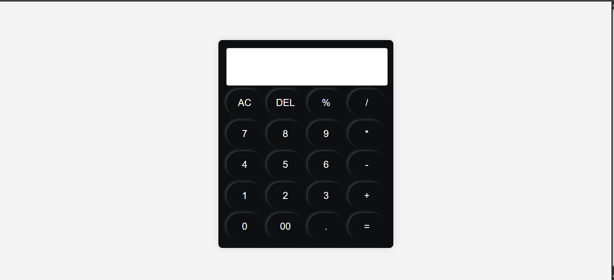

# 🧮 Basic Calculator

A simple calculator application that performs the four basic arithmetic operations: **Addition**, **Subtraction**, **Multiplication** and **Division**.  
Perfect for learning basic programming concepts and operator logic.

---

## ✨ Features

- ➕ Addition of two numbers  
- ➖ Subtraction of two numbers  
- ✖ Multiplication of two numbers  
- ➗ Division of two numbers (with zero-division check)

---

## 📷 Demo
  
*(Replace `screenshot.png` with a screenshot of your game)*

---


## 🛠️ Technologies Used

- **HTML** – For creating the structure and layout of the calculator.  
- **CSS** – For styling the calculator’s appearance and making it visually appealing.  
- **JavaScript** – For implementing the calculator’s functionality and handling user interactions.  
- **Environment:** Visual Studio Code (VS Code) for development and any modern web browser (Chrome, Edge, Firefox) for running the project.


---

## 📦 Installation & Usage

1. **Clone this repository**  
   ```bash
   git clone https://github.com/Suchit-kumar-45/_Basic_Calculator_.git
   cd _Basic_Calculator_
